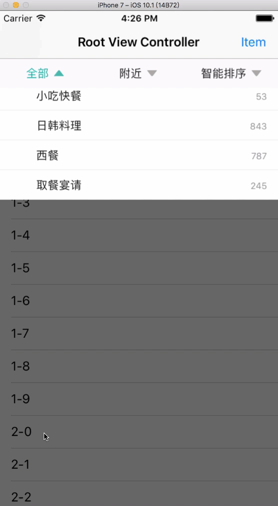
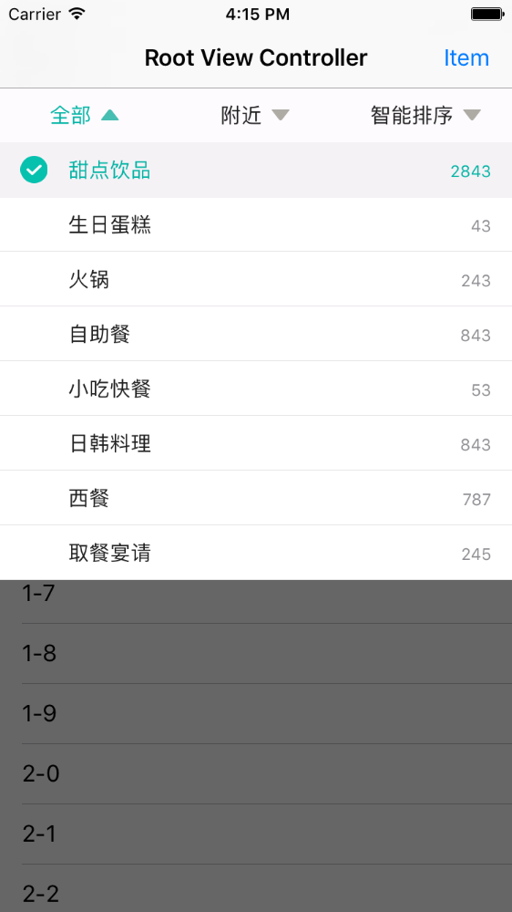
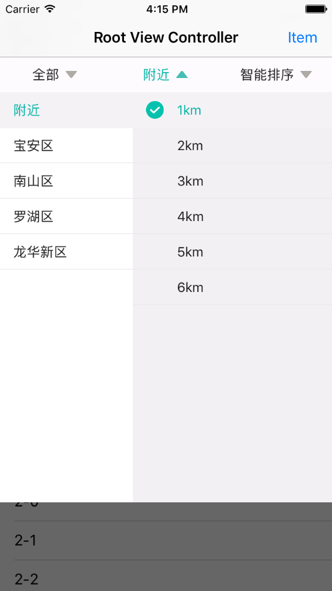

# XPDropdownMenu

适用于UITableView、UICollectionView的下拉菜单，仿美团下拉效果。
如果觉得好用，麻烦请给个`Star`。

当下拉菜单显示为二级面板的时候(参看`附近`)，右侧的数据允许动态地从网络请求。
更多用法请参看Demo.

----

----

## TODO

* 横竖屏适配

## License

`XPDropdownMenu`基于MIT License进行开源，更多内容请参看`LICENSE`文件。
